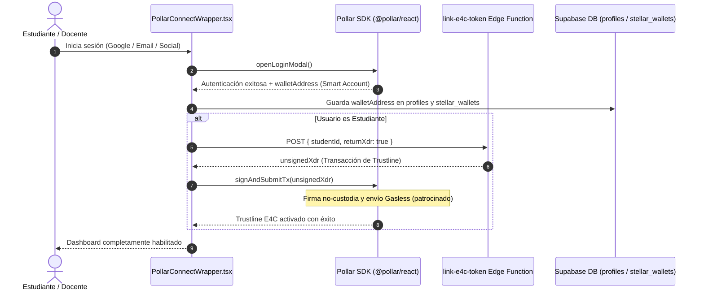
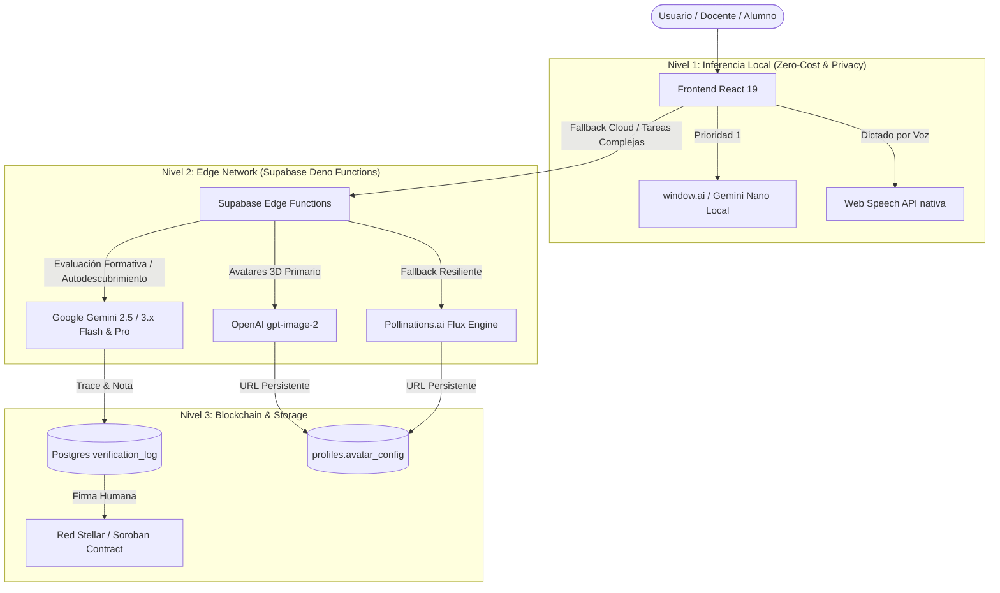

# E4C - Education 4 Culture (Stellar Edition) 🚀

[](https://github.com/)
[](https://github.com/)
[](https://opensource.org/licenses/MIT)
[](https://react.dev/)
[](https://stellar.org/)
[](https://soroban.stellar.org/)
[](https://supabase.com/)
[](https://deepmind.google/technologies/gemini/)

Plataforma educativa descentralizada basada en la **Economía del Mérito**, que transforma el compromiso académico, el presentismo y los logros escolares en activos digitales sobre la red **Blockchain Stellar**. Diseñada para incentivar la superación escolar sin especulación financiera, mitigando la deserción mediante desafíos pedagógicos, bóvedas colectivas de división y beneficios culturales reales provistos por sponsors institucionales y partners adheridos.

---

## 📑 Tabla de Contenidos
- [1. Cabecera y Presentación](#1-cabecera-y-presentación)
- [2. Inicio Rápido](#2-inicio-rápido)
  - [Requisitos Previos](#requisitos-previos)
  - [Instalación](#instalación)
  - [Uso Básico](#uso-básico)
- [3. Configuración y Arquitectura](#3-configuración-y-arquitectura)
  - [Variables de Entorno](#variables-de-entorno)
  - [Estructura del Proyecto](#estructura-del-proyecto)
  - [Roles del Ecosistema](#roles-del-ecosistema)
  - [Stack Tecnológico](#stack-tecnológico)
  - [Autenticación y Onboarding con Pollar Auth (Social Login & Embedded Wallets)](#-autenticación-y-onboarding-con-pollar-auth-social-login--embedded-wallets)
  - [Integración Profunda de Inteligencia Artificial (IA por Solución)](#-integración-profunda-de-inteligencia-artificial-ia-por-solución)
  - [Seguridad y Framework de Gobernanza en IA](#seguridad-y-framework-de-gobernanza-en-ia)
  - [Sistema de Diseño, Tokens UI y Primitivas Atómicas](#-sistema-de-diseño-tokens-ui-y-primitivas-atómicas)
- [4. Mantenimiento y Colaboración](#4-mantenimiento-y-colaboración)
  - [Pruebas y Validación (Testing)](#pruebas-y-validación-testing)
  - [Estrategia de Despliegue DevSecOps](#estrategia-de-despliegue-devsecops)
  - [Guía de Contribución](#guía-de-contribución)
  - [Licencia y Créditos](#licencia-y-créditos)
  - [Marco Normativo CABA](#🏛️-marco-normativo-cumplimiento-del-reglamento-escolar-de-caba)

---

## 1. Cabecera y Presentación

### 🎯 El Concepto: De Tareas a Desafíos
En E4C, los estudiantes no entregan tareas tradicionales, sino que superan **Desafíos**. Cada desafío aprobado acredita recompensas tangibles en tokens E4C (de 1 a 20 E4C base, con notas del examen 1-10 y bonos de mérito académico 1.5x), incentivando el esfuerzo personal, el arte y la cultura dentro de una economía gamificada sin riesgo financiero.

### ✨ Principales Capacidades (v1.62 — Rumbo a Producción)
*   **Reingeniería Pedagógica del Tutor Socrático para Estudiantes de Secundaria (`aiService.ts`, `generate-ai-evaluation` & `SocraticEvaluationModal.tsx`)**:
    *   **Introducción del "Por Qué" y Conexión Temática**: Cada pregunta o repregunta de Eduki se estructura en dos bloques claramente delimitados: (1) `💡 ¿Por qué te pregunto esto?`: breve explicación empática (1 a 2 oraciones) indicando el propósito pedagógico de la pregunta y su vínculo directo con el tema específico del desafío (`«taskTitle»`), y (2) `👉 Tu pregunta:`: una consigna dialéctica situada, comprensible y concreta.
    *   **Lenguaje Accesible y Empático para Adolescentes**: Erradicación definitiva de fórmulas filosóficas abstractas o intimidantes ("¿cuáles son las premisas epistemológicas fundamentales?"). Se reemplazan por consignas cercanas orientadas al razonamiento cotidiano ("¿cómo le explicarías esto a un compañero de clase con un ejemplo sencillo?").
    *   **Renderizado Visual Formateado**: Soporte de párrafos espaciados y resaltado en negrita cian para las etiquetas clave dentro de las burbujas de diálogo del modal socrático.
    *   **Calibración de Rúbrica de 3 Niveles**: Devoluciones acordes a la profundidad: respuesta básica (<20 palabras: orientación constructiva sin elogios desmedidos), respuesta intermedia (20-55 palabras: reconocimiento de autoría) y avanzada (>55 palabras: máxima distinción dialéctica).
*   **Desglose de Respuestas Socráticas en Panel Docente (`TaskReview.tsx`)**:
    *   **Respuestas Separadas y Estructuradas**: Cada intervención y argumento del estudiante frente al tutor Eduki se visualiza individualmente (`Respuesta 1`, `Respuesta 2`, `Respuesta 3`), con etiquetas de fase, pregunta orientadora de Eduki y formato de párrafo espaciado, permitiendo al docente una corrección fluida, legible e intuitiva.
*   **Panel Docente de ABM de Alumnos (`TeacherStudentApproval.tsx` & `TeacherDashboard.tsx`)**:
    *   **Autonomía Operativa Docente**: Sub-pestaña `[ABM de Alumnos]` en la barra de clase con badge en tiempo real de solicitudes pendientes de la institución, descongestionando las tareas administrativas.
    *   **Aprobación Individual y Masiva**: Selección múltiple con checkboxes, barra de progreso y disparo automático en segundo plano de la creación de billetera escolar (`trigger-wallet-creation`) y vinculación de tokens (`link-e4c-token`).
    *   **Edición de Nombres y Datos**: Modal integrado para corregir y actualizar nombres, apellidos, cursos y divisiones de los estudiantes en el padrón institucional.
    *   **Baja y Eliminación de Alumnos**: Modal de confirmación pedagógica con baja definitiva y limpieza en cascada de tareas y registros asociados.
    *   **Atajo Inteligente en Asignación de Desafíos (`TaskAssignment.tsx`)**: Banner orientador cuando hay solicitudes pendientes o cursos vacíos con acceso directo a la gestión ABM.
*   **Catálogo y Eliminación en Cascada de Desafíos Subidos (`TeacherUploadedTasks.tsx`)**:
    *   Pestaña dedicada `[Desafíos Subidos]` que permite a los docentes auditar todas las consignas publicadas, filtrar por curso y división, visualizar la cantidad de alumnos asignados y eliminar tareas obsoletas mediante un modal de confirmación pedagógica con eliminación en cascada de entregas asociadas.
*   **Resiliencia en Toma de Asistencia, Confirmación Preventiva y Control de Interrupción (`DailyAttendanceModule.tsx`)**:
    *   **Persistencia Multi-Nivel Garantizada**: Resguardo atómico y sincronizado (`localStorage` + Supabase `attendance_logs` + Smart Contract Soroban `validate_daily_attendance`), con barra superior de partes históricos registrados por fecha y turno.
    *   **Popup Modal de Confirmación Preventiva**: Antes de ejecutar la toma de asistencia, el sistema abre un popup modal de confirmación (*«¿Desea tomar asistencia al curso X división X?»*), detallando escuela, fecha, cantidad total de alumnos y conteo clasificado de Presentes, Tardes, Ausentes y Justificados, evitando tomas o acreditaciones accidentales con opciones claras de «Sí, Tomar Asistencia» y «No, Cancelar».
    *   **Capacidad de Detención Proactiva («Detener Proceso»)**: Botón de detención visible y activo en la cabecera, en la barra de progreso en vivo y dentro del modal overlay de emisión, permitiendo al docente interrumpir el proceso de forma segura en cualquier momento sin pérdida de datos ni duplicación de tokens.
*   **Modo Planificación Curricular Docente — Asistente Tipo NotebookLM (`syllabusService.ts` & `TeacherSyllabusModal.tsx`)**:
    *   **Ingesta Contextual de Archivos Curriculares**: Cada docente puede cargar su propia planificación anual, bimestral o de unidad (`.pdf`, `.txt`, `.md`) asociada de forma estricta a su escuela, curso y división.
    *   **Extracción Client-Side Segura con PDF.js**: Procesamiento nativo y privado en el navegador mediante `pdfjs-dist@3.11.174` con reconstrucción espacial de párrafos (`transform[5]`), sin exponer documentos privados a servidores intermedios no autorizados.
    *   **Algoritmo Guardián Anti-Volcados Binarios (`isRawBinaryPdf`)**: Detecta y sanea automáticamente fragmentos binarios corruptos o streams de objetos PDF (`%PDF-1.7`, `stream...endstream`), previniendo inyecciones de código máquina en el prompt de la IA y mostrando una alerta clara si el documento es una imagen escaneada sin OCR.
    *   **Autodetección Inteligente de Unidades Temáticas (`extractUnitsFromText`)**: Analiza la estructura del documento identificando encabezados ("Unidad", "Bloque", "Eje Temático", "Módulo") y permitiendo seleccionar la unidad de trabajo con un solo clic.
*   **Selector de Unidad Temática y Trayectoria Cognitiva en Eduki Guía (`AIAssistant.tsx`)**:
    *   **Modalidad Dual de Planificación**: Si el curso cuenta con planificación cargada, el docente puede seleccionar interactivamente la unidad a trabajar:
        *   **Unidad Actual**: Eleva la exigencia cognitiva pasando a un tema superior y más complejo dentro del mismo bloque temático.
        *   **Siguiente Unidad / Nueva Unidad**: Diseña un nuevo desafío introductorio o de articulación basado en los contenidos de la siguiente unidad curricular, utilizando los aprendizajes previos como puente.
    *   **Control de Continuidad Pedagógica (ON/OFF)**: Switch interactivo para decidir si el nuevo desafío continuará la trayectoria del trabajo anterior (`usePreviousContext: true`) o comenzará un tema nuevo e independiente (`usePreviousContext: false`).
    *   **Botón Instantáneo de 1 Clic («⚡ Siguiente Nivel / Iniciar Primer Desafío»)**: Generación inmediata de la consigna sin requerir la redacción manual de prompts extensos.
    *   **Tarjeta Orientadora de Primer Desafío Fundacional**: Si el curso aún no registra tareas previas, la interfaz exhibe una guía clara indicando que se creará el *Desafío Fundacional (Nivel 1 - Diagnóstico y Disparador)*.
*   **Secuencias Didácticas Oficiales CABA & Retención Automática de Materia Asignada (`TeacherDashboard.tsx`, `TaskAssignment.tsx`)**:
    *   **Erradicación de Términos Comerciales ("Turnkey")**: Sustitución sistemática por la denominación pedagógica formal e institucional: **"Secuencias Didácticas Oficiales CABA"** / **"Secuencias & Rúbricas CABA (Listas para Usar)"**, alineadas con los NAP y la NES / Secundaria Aprende de CABA.
    *   **Retención Estricta de Materia Asignada**: Al despachar desafíos generados desde Eduki Guía hacia el formulario asignador (`TaskAssignment.tsx`), el sistema preselecciona y fija automáticamente la materia del profesor (`filterSubject`), garantizando que nunca quede en blanco ni bloquee la publicación de la consigna.
*   **Aislamiento Contextual y Selección de Curso y División en Eduki Guía (`AIAssistant.tsx`, `TaskAssignment.tsx` & `TeacherDashboard.tsx`)**:
    *   **Barra de Destino Pedagógico**: Incorporación de selectores integrados de Curso (`CURSO_OPTIONS`) y División (`DIVISION_OPTIONS`) en la cabecera de Eduki Guía con contador en tiempo real de desafíos previos registrados para ese grupo específico (`scopedTasks.length`).
    *   **Prevención de Cruce de Divisiones**: Normalización y filtrado estricto con `normalizeCourse` y `normalizeDivision`. Las consultas de continuidad pedagógica y sugerencias de ZDP solo analizan los antecedentes del curso y división seleccionados por el docente, erradicando la interferencia o cruce de datos entre divisiones paralelas (ej: 3ro 1ra vs 3ro 2da).
    *   **Sincronización en Cascada en el Asignador**: Al autogenerar un desafío o activar una secuencia oficial, la plataforma transfiere automáticamente el curso y la división hacia `TaskAssignment.tsx`, actualizando tanto los campos de la tarea (`newTaskCurso`, `newTaskDivision`) como los filtros del padrón de alumnos (`filterCurso`, `filterDivision`).
*   **Auditoría Integral de Seguridad y Remediación de Smart Contracts Stellar Soroban ([`contracts/AUDIT_FINDINGS.md`](file:///C:/E4C-Desarrollo/contracts/AUDIT_FINDINGS.md) & [`contracts/AUDIT_IMPROVEMENTS.md`](file:///C:/E4C-Desarrollo/contracts/AUDIT_IMPROVEMENTS.md))**:
    *   **Remediación de Storage de Instancia (64KB DoS - E4C-SEC-01)**: Migración completa de colecciones dinámicas (`StudentChallenge`, `StudentAttendance`, `Voucher`, `StudentPassport`) desde `instance()` hacia `persistent()`. Para límites efímeros de colusión docente-alumno (`StudentTeacherMint`), adopción de almacenamiento `temporary()` con costo de renta cero tras su ciclo diario.
    *   **Blindaje de Control de Acceso y Erradicación de Vector de Drenaje (E4C-SEC-02)**: Eliminación definitiva de la función `mint_e4c` desprotegida en `token_swap`. Consolidación estricta de la emisión pedagógica en `edu_validator` con firma docente registrada y cuotas anti-colusión.
    *   **Gestión Sistemática de Ciclo de Vida y Renta (TTL - E4C-SEC-03)**: Incorporación de extensiones proactivas de TTL (`BUMP_THRESHOLD` 30 días, `BUMP_TO` 120 días) en todos los contratos y entrypoints de lectura/escritura, previniendo el archivado de estado durante recesos escolares.
    *   **Manejo Estructurado de Errores Tipados (E4C-SEC-04)**: Sustitución de `panic!` y `.expect!` por el enum `#[contracterror]` estructurado `EscrowError` en `partner_escrow`.
    *   **Clarificación Criptográfica en Smart Accounts (E4C-SEC-05)**: Nomenclatura explícita `SignerKey` para firmas Ed25519 con fallback retrocompatible hacia `PasskeyId`.
    *   **Cobertura Exhaustiva de Tests Unitarios (E4C-SEC-06)**: Implementación de suites `#[cfg(test)]` en Rust simulando tokens SAC, quema dual ($E4C $\rightarrow$ $ACT $\rightarrow$ Ticket Taquilla), intentos de doble gasto y rechazo de actores no autorizados.
*   **Reingeniería de Cupones Culturales y Marketplace Estudiantil (`Marketplace.tsx` & `tokenSwapService.ts`)**:
    *   **Doble Pestaña Superior Reactiva**: Switcher prominente en la cabecera del catálogo: `[🎭 Explorar Catálogo ({n})]` vs `[🎟️ Mis Cupones Adquiridos ({n} activos)]`, con conteo dinámico en tiempo real.
    *   **Tira Superior de Acceso Rápido**: Banner superior persistente que detecta cupones activos sin utilizar y despliega el botón directo `[📱 Ver QR / Pase]`, erradicando la antigua sección que quedaba sepultada al final del scroll (`mt-12`).
    *   **Priorización Estricta y Filtros de Estado**: Los cupones activos se listan primero en orden cronológico descendente, seguidos de los ya canjeados, con selector de píldoras: `[Cupones Activos]`, `[Todos]`, `[Ya Utilizados]`.
    *   **Diseño de Alto Contraste**: Borde esmeralda brillante (`border-emerald-500/50`) para pases disponibles y diseño atenuado para cupones ya consumidos en boletería.
*   **Persistencia Multi-Nivel y Normalización de Vouchers Soroban / Pases Culturales**:
    *   **Resolución de Incompatibilidad UUID en Supabase**: Sanitización del schema de base de datos donde `redeems.id` es tipo UUID; el identificador alfanumérico Soroban (`ACT-XXXXXXXXX`) se persiste en la columna `voucher_uuid` autogenerando un UUID válido en `id`.
    *   **Recuperación Híbrida Desduplicada**: Adición de `tokenSwapService.getStudentVouchers(studentId)` para recuperar de inmediato el historial de pases cacheados en `localStorage` unificándolos con Supabase (`redeems`), desduplicando por `voucher_uuid` y reconciliando marcas de tiempo (`created_at` / `redeemed_at`).
    *   **Lectura Flexible en Terminal POS Taquilla (`/pos`)**: Los métodos `getVoucherStatus` y `burnACTForTicket` admiten búsqueda dual tanto por `voucher_uuid` como por UUID de base de datos, garantizando validación y quema sin fricción en comercios adheridos.
    *   **Badge de Cupones Activos Sincronizado**: Sincronización reactiva del contador de cupones activos en la cabecera de `StudentDashboard.tsx` (`activeCouponsCount`).
*   **Estabilidad Visual y Prevención de Ciclos de Re-renderizado**:
    *   **Erradicación de Loop Infinito**: Desacoplamiento de la dependencia circular entre `rewards` y `fetchRedeemHistory` mediante `rewardsRef` y dependencias fijas en `[studentId]`, erradicando peticiones redundantes a `setLoadingHistory`.
    *   **Supresión de Parpadeos Intermitentes**: Erradicación de clases `animate-pulse` y `animate-ping` invasivas en los badges e iconos de cupones, otorgando solidez visual y serenidad estética a la interfaz.
*   **Navegación Fluida Sin Recargas Involuntarias (No-Flicker Navigation)**:
    *   **Modal de Cupón No-Reload**: La bandera `isViewingExistingVoucher` al cerrar la vista de QR ("Volver al catálogo") previene el disparo de `onBalanceChanged` y recálculos redundantes, con botones de tipo explícito `type="button"`.
    *   **Ref `hasLoadedStudentRef` en `StudentDashboard.tsx`**: El esqueleto de carga a pantalla completa (`setLoading(true)`) ahora se restringe exclusivamente al primer montaje del alumno. Las recargas de balance y sincronizaciones posteriores se ejecutan en segundo plano sin desmontar la UI ni provocar parpadeos de shimmer.
*   **Generación Táctil e Intuitiva de Avatar Estudiantil (`StudentDashboard.tsx` & `AvatarModal.tsx`)**:
    *   Acceso táctil directo desde la tarjeta de perfil/avatar escolar del estudiante.
    *   Si no posee imagen asignada, el recuadro muestra una placa interactiva amigable: *"Sin avatar, presioná acá para crearlo"*.
    *   Al hacer clic sobre el recuadro, la pantalla ejecuta un desplazamiento suave centrado (`scrollIntoView({ behavior: 'smooth', block: 'center' })`) hacia la sección de creación de avatar y enfoca el cursor automáticamente en el campo de texto del prompt.
*   **Auto-Minimizado de Eduki Guía Docente (`AIAssistant.tsx`)**:
    *   Al autogenerar una consigna con IA y volcar con éxito los datos en el formulario principal (`TaskAssignment.tsx`), Eduki Guía se minimiza automáticamente a su cápsula flotante para no obstruir la pantalla y concentrar toda la atención del profesor en el formulario de edición y asignación.
*   **Micro-Learning Docente en Guía de Bolsillo (`TeacherPocketGuide.tsx`)**:
    *   Bloqueo preventivo de cápsulas de video en etapa de preproducción con estado "Próximamente", cursor `not-allowed`, overlay visual oscuro y tooltip institucional informativo para evitar clics infructuosos.
*   **Kits de Aula «Turnkey» y Biblioteca Curricular Oficial (`curriculumTemplates.ts`)**: Secuencias didácticas prediseñadas listas para ejecutar en 1 clic para Física, Química, Matemática, Lengua y Formación Ética, alineadas con la NES / Secundaria Aprende (CABA / PBA). Cada plantilla incorpora disparadores socráticos, objetivos de aprendizaje, criterios de evaluación y contraejemplos calibrados.
*   **Motor Dialéctico Eduki con Heurísticas y «Trampas Cognitivas»**: Desarticulación de respuestas mecánicas o generadas por IA mediante contraejemplos epistémicos en tiempo real: en Física (aceleración gravitatoria en la cúspide del tiro vertical), Química (minimización de energía potencial electrostática vs analogía antropomórfica de estabilidad) y Matemática (contraejemplos numéricos $3^2+4^2 \neq (3+4)^2$).
*   **Exportador de Secuencia Didáctica Oficial en 1 Carilla (`SocraticRubricPDF.tsx`)**: Generador de planificaciones A4 imprimibles con membrete oficial del *Ministerio de Educación CABA*, bloque curricular, secuencia temporal de 60 minutos (10m disparador, 30m Eduki, 20m plenario) y rúbrica de 3 niveles (*Inicial*, *En Proceso*, *Logrado*) para entrega inmediata a secretaría y dirección escolar.
*   **Guía de Bolsillo Low-Touch y Soporte Directo WhatsApp (`TeacherPocketGuide.tsx`)**: Tarjeta de aula imprimible con el glosario estandarizado de comandos de voz ("Presentes todos", "Ausentes: [Apellido]", "Tarde: [Apellido]", "Justificado: [Apellido]"), carrusel de micro-learning (Reels de 45-60s) y botón de asistencia técnica ágil por WhatsApp (`+54 9 11 2634-8727`).
*   **Reconocimiento Pedagógico Docente y Gamificación Inversa (`TeacherCertificateView.tsx`)**: Emisión de diploma institucional avalado por E4C Education y Dirección Escolar con badge de *"Docente Pionero E4C — Innovación Pedagógica en Aula"*. Reconoce y certifica la adhesión pedagógica, compromiso y liderazgo del educador en la plataforma (sin computar horas cátedra oficiales ministeriales). Activa el desbloqueo colectivo de cupos prioritarios para salidas culturales (Planetario Galileo Galilei, Cine Gaumont, salas CTBA) al alcanzar $\ge 85\%$ de presentismo y $\ge 75\%$ de aprobación en la división.
*   **Economía de Perseverancia Docente y Marketplace Cultural (`TeacherMarketplaceView.tsx`)**: Incentivo docente directo que acredita **+1 Token E4C por cada desafío completado/aprobado** por un estudiante del curso a su cargo, premiando la constancia y seguimiento docente frente al aula. Los docentes cuentan con su propio **Marketplace Cultural Docente** para canjear sus tokens acumulados por vouchers pedagógicos y culturales (Fondo de Cultura Económica, Teatro CTBA, Cine Debate Gaumont, Cafés Literarios y suscripciones educativas digitales).
*   **Dashboard Ejecutivo para Equipos Directivos y Supervisión (`ExecutiveDirectorDashboard.tsx`)**: Semáforo normativo de ausentismo crónico (Alerta Amarilla ante 3 inasistencias o <85%, Alerta Roja ante 5 consecutivas o 10 alternadas según Reglamento Escolar CABA Art. 83 bis), junto con KPIs de impacto: *Índice de Autoría y Pensamiento Crítico*, *Tiempo Lectivo Recuperado* y *Tasa de Compromiso Cultural ($ACT)*.
*   **Eduki Guía: Guías Pedagógicas Instantáneas CABA y Motor de Orientación Formativa (`pedagogical_guidance`)**: Acceso directo en 1 toque en Eduki Guía (`AIAssistant.tsx`) a las 3 guías de cabecera pedagógicas docentes con respuesta inmediata y sin latencia: (1) **Régimen Académico CABA (Res. N° 223/MEDGC/26)** con avance continuo, erradicación del promedio punitivo y los 3 niveles de logro (*Inicial*, *En Proceso*, *Logrado*), (2) **Dinámicas Socráticas de Debate en Aula** (*Pecera Dialéctica / Fishbowl*, *Equipos de Perspectivas Contrapuestas*, *Ronda Relámpago de Preguntas Provocadoras*), y (3) **Integridad Académica y Detección Formativa Anti-Copia de IA** sin confrontación punitiva. Desacoplamiento de la Edge Function `generate-ai-evaluation` y `aiService.ts` mediante la nueva acción `pedagogical_guidance` y guardias de seguridad resilientes para atender preguntas abiertas y consultas conceptuales de los docentes sin errores de esquema.
*   **Motor de Continuidad Pedagógica y Avance Continuo (Res. N° 223/MEDGC/26)**: Eduki Guía (`AIAssistant.tsx`) audita reactivamente el historial de tareas de la materia y curso activo para identificar el último desafío creado. Basándose en la Zona de Desarrollo Próximo, diagnostica la trayectoria pedagógica y genera el **Desafío Siguiente en Dificultad** escalando naturalmente la complejidad: de Desafío inicial (1-10 E4C) $\rightarrow$ Trabajo Práctico de análisis crítico y relación de variables (10-14 E4C) $\rightarrow$ Evaluación Integral / ABP con dilemas situados (15-20 E4C). Si no existen entregas previas, activa automáticamente el **Desafío Fundacional (Nivel 1 - Diagnóstico y Disparador)**, siempre articulando con la advertencia obligatoria de Integridad Académica.
*   **Selector Universal de Perfiles Institucionales (`Navigation.tsx`)**: Menú interactivo permanente en todas las resoluciones que centraliza los 7 roles del sistema (Admin, Docente, Preceptor, Estudiante, Validador, Ranking, Gobierno) con anclaje fijo del botón de cierre de sesión.
*   **Asistencia Híbrida Voz/Táctil (`/modules/attendance`)**: Conmutador reactivo entre toma por voz continua (`AttendanceVoiceView.tsx` con fuzzy NLP matching por distancia Levenshtein sobre nómina y dictado masivo) y grilla táctil manual rápida (`AttendanceManualView.tsx` con botones 1-toque `[P]`, `[A]`, `[T]`, `[J]`, buscador instantáneo y marcado masivo), preservando intacto el motor de persistencia multi-nivel (`localStorage` + Supabase + Smart Contract Soroban de presentismo escolar).
*   **Motor Socrático de Integridad Académica con Cero Latencia y Detección Inmediata de Copia IA / Pegado (`/modules/evaluations`, `aiCopyDetector.ts`, `aiService.ts` & `MyTasks.tsx`)**: Sistema dialéctico de evaluación reflexiva integrado con el robot **Eduki** (`SocraticEvaluationModal.tsx`). Incorpora apertura síncrona instantánea en 0ms (`getInstantOpeningQuestion`) que erradica pantallas de carga iniciales y spinners prematuros, rastreo de eventos de pegado directo del portapapeles (`onPaste`) y el **Motor de Detección Heurística de Copia de IA** (`aiCopyDetector.ts`). Analiza en tiempo real y a nivel de token marcas explícitas de LLMs (ChatGPT, Claude, Gemini, DeepSeek), sintaxis de listas artificiales (`* **Concepto:**`), fórmulas de transición mecánicas (`es importante destacar`, `en conclusión`) y vocabulario hiper-formal no adolescente. Si el estudiante pega contenido generado por IA en cualquier fase dialéctica, Eduki lo interpela inmediatamente exigiendo fundamentación con sus propias palabras y ejemplos cotidianos. En la evaluación final, el uso de IA o copia textual se dictamina de forma **inmediata y local (0ms)**, degradando el índice de originalidad (`anti_copy_score < 60%`), reprobando la nota (`score <= 4`), anulando tokens (`0 E4C`) y declarando la entrega como **NO APROBADA** sin esperas de red. **Protocolo Estricto de Entrega y Reintento Formativo**: En `MyTasks.tsx`, la opción de completar permanece estrictamente bloqueada (`canCompleteTask = false`) ante cualquier defensa desaprobada por IA, obligando al estudiante a pulsar *"🔄 Reintentar Defensa Socrática (Con tus Propias Palabras)"* y adjuntar evidencia genuina para habilitar el envío formal al docente.
*   **Tokenómica Dual en Soroban Rust (`contracts/token_swap`)**: Smart Contract `E4CCulturalGateway` (`#![no_std]`) con métodos `mint_e4c`, `swap_e4c_for_act` (**Quema 1**: canje de $E4C $\rightarrow$ Pase Cultural $ACT) y `burn_act_for_ticket` (**Quema 2**: validación y quema definitiva en taquilla cultural). Servicio cliente `tokenSwapService.ts` con persistencia multi-tier y deduplicación.
*   **Pase Cultural PWA y Terminal POS Taquilla Web (`/pos`)**: Credencial y tarjeta de billete cultural `CulturalPassCard.tsx` bajo la disciplina de tinta única (Teja Cultura `#A6402B`, Papel `#F4F1EA`, Verde Verificado `#2F6B58`). Terminal web POS abierta y universal en `/pos` (`POSScannerView.tsx`) de acceso restringido exclusivo a roles `admin` y `taquilla`, con escáner de cámara nativo (`BarcodeDetector`), campo manual de código y confirmación de quema definitiva on-chain para entrega de entradas físicas en comercios y teatros sin requerir descargas ni instalaciones.
*   **Asistente Docente Eduki Guía con Borde de Alto Contraste Lente Neón (`AIAssistant.tsx`)**: Cápsula flotante del asistente docente individualizada formalmente como **Eduki Guía**, blindada contra FOUC con base obsidiana (`#020617`), **borde sólido celeste neón de 2.5px (`#38bdf8` / Sky 400)**, **anillo exterior concéntrico (`ring-2 ring-sky-400/50`)** y **halo ambiental luminoso (`boxShadow`)**, garantizando máxima visibilidad y relieve estético sobre fondos claros y oscuros.
*   **Optimización de Empaquetado y Chunks Vite (`manualChunks`)**: División modular de bundles pesados (`vendor-stellar`, `vendor-supabase`, `vendor-react`, `vendor-ui`), eliminando advertencias de tamaño y optimizando drásticamente los tiempos de carga y la caché del navegador.
*   **Eduki: Profesor Robot Futurista Libre y Conector Cuántico Holográfico (`EdukiRobotAvatar.tsx` / `StudentAIWelcomeCard.tsx`)**: Avatar completamente libre y transparente (sin recuadros ni marcos de TV) con **gafas inteligentes holográficas (`eduki-glasses-gleam`)**, **birrete cuántico con borla dorada**, traje científico-académico perlado con insignia estelar E4C, **libro digital holográfico interactivo (`eduki-holo-book`)**, brazo articulado con **gesto de aprobación "OK" / pulgar arriba**, ciclo de guiño con destello estelar (`✨`), propulsor de plasma y **nodo de conexión cuántica holográfica unificado** hacia la viñeta 3D flotante con perspectiva CSS.
*   **Formulario Docente de Desafíos Maximizable y Auto-Minimizado (`TaskAssignment.tsx` / `AIAssistant.tsx`)**: Formulario de creación de consignas ampliable a modal flotante de alta resolución o pantalla completa (`Fullscreen`), con tecla de escape `Esc` y auto-minimizado inmediato tras presionar *"Confirmar y Publicar Desafío"*. Al generar un desafío desde el asistente **Eduki Guía**, el sistema navega automáticamente a la pestaña de asignación y abre el modal maximizado con todos los campos precompletados.
*   **Sistema de Diseño E4C & Tokens UI Atómicos (`index.css` / `Button.tsx`)**: Estandarización completa de botones primarios cian con halo neón (`.e4c-btn-primary`), superficies glassmorphic con desenfoque de 24px (`.e4c-card-surface`), inputs de alto contraste y badges semánticos certificados WCAG AA.
*   **Emisión Automática On-Chain por Smart Contract (`contractValidator.ts` / `EduValidatorContract`)**: La validación de entregas y la emisión de tokens E4C en Stellar Testnet están 100% automatizadas por el contrato inteligente Soroban. Al calificar y aprobar un desafío pedagógico, el Smart Contract verifica las reglas de cuotas y anticolusión y emite inmediatamente los tokens a la wallet del alumno sin necesidad de intervención manual de validadores humanos.
*   **Sincronización Automática y en 1-Clic de Emisiones On-Chain (`syncPendingTeacherApprovedTasks`)**: Rutina proactiva integrada en el panel docente y de administración para transferir automáticamente a Stellar cualquier entrega pendiente.
*   **Diagnóstico Holográfico Estudiantil**: Diagnóstico en vivo al entrar al panel estudiantil:
    1. 📝 *Desafíos*: Conteo exacto de trabajos aprobados y pendientes (`"Tenés X trabajos aprobados y Y pendientes"`).
    2. 📅 *Presentismo*: Conteo de días presentes y ausencias registradas (`"Tenés X presentes y Y ausentes"`).
    3. 🎟️ *Marketplace*: Evaluación del saldo de tokens frente a premios disponibles (`"¡Tus tokens ya te alcanzan para..."` o `"Te faltan X tokens para..."`).
    4. 🎨 *Avatares con IA*: Recordatorio destacado para diseñar personajes 3D por IA utilizando los tokens acumulados.
    5. 🎛️ *Minimizado en 1-Clic*: Opción *"¡Entendido, minimizar!"* para plegar el asistente a una cápsula compacta flotante y reabrirlo cuando se desee.
*   **Tutor Eduki Estudiantil Flotante y Arrastrable (`StudentAIAssistant.tsx`)**: Asistente con dictado por voz (`Web Speech API`), atajo global de teclado (`/`), grip de arrastre dedicado y chips contextuales de orientación pedagógica segura.
*   **Módulo de Alta y Gestión de Preceptores con Scope Estricto (`PreceptorManagement.tsx`)**: Gestión de preceptores en el panel de Administrador con asignación multi-curso y escuela, blindando su visión exclusivamente a sus cursos autorizados en Toma Diaria y Libro Matriz.
*   **Módulo Docente de Calificaciones y Evaluaciones (`TeacherGradesView.tsx`)**: Matriz de notas interactiva por materia, promedios ponderados (1 a 10), bonos de mérito (+1.5x) y exportación oficial a CSV.
*   **Libro Matriz Mensual de Asistencia y Semáforo CABA (`MonthlyAttendanceMatrix.tsx`)**: Auditoría mensual de presentismo por escuela y curso con semáforo de regularidad (Art. 83 bis [VERIFICAR CON ASESORÍA LEGAL]) y tokens de mérito en Stellar Testnet.
*   **Arquitectura de Persistencia Total y Keep-Alive (Zero Data Loss)**: Retención de estado y sincronización con `sessionStorage` en todos los roles.
*   **Gestión y Desbloqueo de Inconsistencias Institucionales (`InconsistencyReview.tsx`)**: Bandeja de auditoría y desbloqueo auditado para administradores con transferencia on-chain inmediata.
*   **Aislamiento Estricto de Roles (RBAC) en Asistente Inicial, Centro de Ayuda y Navegación (`OnboardingTour.tsx` / `HelpModal.tsx` / `Navigation.tsx` / `authContext.tsx`)**: Blindaje de seguridad integral según normativas escolares (Reglamento Escolar CABA / Ley N° 25.326 / Ley N° 26.061). Los perfiles de alumno (`student`) acceden única y exclusivamente a sus 8 secciones de estudiante en la barra de navegación (`Estudiante` y `Ranking`), en el Centro de Tutoriales e Inicio Rápido interactivo (`OnboardingTour`), y en el Centro de Ayuda & FAQ (`HelpModal` con badge `🎓 Secciones de Alumno`), imposibilitando la visualización, conmutación o filtrado de paneles docentes, preceptoriales o administrativos.
*   **Bóvedas Colectivas por División con Datos Reales**: Fondos colaborativos de curso respaldados en Stellar Horizon y Supabase (`student_tasks` + `attendance_logs`).
*   **Avatares 3D con IA y Papelera de 30 Días**: Generador OpenAI `gpt-image-2` con fallback automático a Pollinations.ai (Flux), economía de tokens (2, 4, 6 E4C), biblioteca persistente y papelera reciclable con auto-limpieza.

---

## 2. Inicio Rápido

### Requisitos Previos
Asegúrate de contar con el siguiente entorno instalado:
*   **Node.js**: `>= 18.x` (Recomendado LTS)
*   **npm**: `>= 9.x`
*   **Git**: `>= 2.x`
*   **Supabase CLI** (opcional, para desarrollo y despliegue de Edge Functions)
*   **Rust & Stellar CLI** (opcional, para compilación de contratos inteligentes Soroban)

### Instalación

1. **Clonar el repositorio**:
   ```bash
   git clone https://github.com/tu-usuario/E4C-Desarrollo.git
   cd E4C-Desarrollo
   ```

2. **Instalar dependencias del frontend**:
   ```bash
   npm install
   ```

3. **Configurar las variables de entorno**:
   Copia el archivo de plantilla `.env.example` a `.env`:
   ```bash
   cp .env.example .env
   ```

### Uso Básico

Inicia el servidor de desarrollo local de Vite:
```bash
npm run dev
```
Abre tu navegador en `http://localhost:5173`.

---

## 3. Configuración y Arquitectura

### Variables de Entorno

Crea un archivo `.env` en la raíz del proyecto con las siguientes variables:

```env
# Conexión a Supabase Backend
VITE_SUPABASE_URL=https://tu-proyecto.supabase.co
VITE_SUPABASE_ANON_KEY=tu_supabase_anon_key
```

> **Nota de Seguridad (OWASP A05):** Las claves secretas (`SUPABASE_SERVICE_ROLE_KEY`, `GEMINI_API_KEY`, `OPENAI_API_KEY` y `DISTRIBUTOR_SECRET_KEY`) residen **exclusivamente** en los Secretos de Supabase (`supabase secrets set`) y nunca deben exponerse en el frontend.

### Estructura del Proyecto

```text
E4C-Desarrollo/
├── contracts/                    # Contratos Inteligentes Soroban (Rust #![no_std])
│   ├── edu_validator/            # Validación escolar, cupos y asistencia diaria idempotente
│   └── token_swap/               # Gateway Cultural Soroban (Doble Quema: E4C->ACT->Ticket)
├── src/
│   ├── components/               # Componentes de la interfaz de usuario por rol
│   │   ├── admin/                # Aprobación masiva, gestión docente/alumno, auditoría de bóvedas
│   │   ├── auth/                 # Wrapper y conexión de billeteras con Pollar Auth
│   │   ├── government/           # Panel de analítica macro y estadísticas jurisdiccionales
│   │   ├── preceptor/            # Control de asistencia diaria (Art. 137 CABA) y partes por voz
│   │   ├── ranking/              # Podio 3D y Leaderboards públicos de mérito (@alias)
│   │   ├── shared/               # Asistente Eduki, Modales de Ayuda, Splash Screen
│   │   ├── student/              # Bóveda Colectiva, Pasaporte 3D, Asistencia, Marketplace, Avatares
│   │   ├── teacher/              # Creación de desafíos con Eduki, revisión pedagógica y rúbricas
│   │   └── validator/            # Centro de autorización y validación Stellar
│   ├── modules/                  # Módulos especializados de alto rendimiento v1.55
│   │   ├── attendance/           # Asistencia Híbrida (Voz continua NLP y Grilla Táctil rápida)
│   │   ├── evaluations/          # Motor Socrático de Integridad Académica con Eduki (defensa dialéctica)
│   │   └── pos/                  # Terminal POS Web de Taquilla Cultural (/pos) para comercios
│   ├── lib/                      # Clientes de Supabase, Passkeys (PBKDF2) y Stellar SDK
│   ├── services/                 # Integración de IA (aiService), tokenSwapService, avatares
│   ├── types.ts                  # Definiciones y contratos de tipos TypeScript
│   └── App.tsx                   # Enrutador principal y conmutación de roles RBAC
├── supabase/
│   ├── functions/                # Edge Functions en Deno runtime (TypeScript)
│   │   ├── buy-store-item/       # Adquisición de avatares con tokens
│   │   ├── generate-ai-evaluation/# Evaluación pedagógica con Google Gemini
│   │   ├── generate-avatar-video/# Generador de avatares 3D (OpenAI / Pollinations)
│   │   ├── link-e4c-token/       # Establecimiento de Trustlines Stellar
│   │   ├── redeem-e4c-tokens/    # Canje seguro de beneficios en Marketplace
│   │   ├── send-e4c-tokens/      # Emisión atómica de tokens por mérito escolar
│   │   └── trigger-wallet-creation/# Creación y fondeo automático de billeteras Stellar
│   └── migrations/               # Esquemas SQL, tablas, restricciones y políticas RLS
├── .github/workflows/            # Pipeline CI/CD (deploy-prod.yml)
├── eslint.config.js              # Configuración ESLint v10 Flat Config
├── vite.config.ts                # Empaquetado Vite optimizado con manualChunks modulares
└── package.json                  # Scripts y dependencias del proyecto
```

### Roles del Ecosistema

1.  **🧑‍🎓 Estudiante**: Supera desafíos pedagógicos, defiende sus trabajos en el Motor Socrático de Integridad Académica, consulta su asistencia (Art. 83 bis), canjea Pases Culturales $ACT y gestiona sus tokens en el Pasaporte Digital.
2.  **👩‍🏫 Docente**: Diseña desafíos calibrados con Eduki, toma asistencia híbrida (Voz / Táctil), califica con rúbricas objetivas y aprueba entregas con emisión on-chain Soroban.
3.  **🤖 Smart Contract (Soroban)**: Audita y emite de forma 100% autónoma las transacciones en Stellar (`EduValidatorContract` y `E4CCulturalGateway`), aplicando cupos, unicidad y doble quema para accesos culturales.
4.  **📋 Preceptor**: Registro diario de asistencia oficial (Art. 137 CABA), seguimiento preventivo en el Libro Matriz Mensual y conmutación ágil de modalidades de presentismo.
5.  **🎟️ Comercio / Taquilla Cultural**: Validación y quema definitiva de entradas en la Terminal Web POS (`/pos`) mediante escaneo de cámara o código alfanumérico sin instalación previa.
6.  **🏛️ Gobierno**: Supervisión macro, analítica en tiempo real (`Recharts`), auditoría de bóvedas colectivas jurisdiccionales y exportación oficial CSV.
7.  **👑 Administrador**: Aprobación masiva de usuarios con checkboxes, gestión global de cuentas, gestión de preceptores, auditoría de inconsistencias y supervisión económica.

### Stack Tecnológico

*   **Frontend**: React 19 + TypeScript + Vite 7 + Tailwind CSS 4 + Lucide Icons + Recharts + Canvas Confetti + BarcodeDetector API nativa.
*   **Web3 & Blockchain**: Red Stellar (Stellar SDK `@stellar/stellar-sdk` v14) + Contratos Inteligentes Soroban en Rust (`#![no_std]`, contratos `edu_validator` para reglas académicas y `token_swap` para economía de pases culturales) + Stellar Horizon / RPC.
*   **Autenticación & Wallets**: Pollar Auth (`@pollar/react` - Social Logins & Embedded Smart Accounts) + Google OAuth (Supabase Auth) + Passkeys / WebAuthn con derivación PBKDF2 (SHA-512, 100k iteraciones) + Freighter Wallet.
*   **Backend & Base de Datos**: Supabase (PostgreSQL 15 con Row Level Security - RLS, Suscripciones Realtime `postgres_changes`) + Edge Functions en Deno runtime.
*   **Inteligencia Artificial**: Google Gemini 1.5 Flash (Cloud Edge) + Gemini Nano / `window.ai` (Local First) + Web Speech API (Voz y Asistencia Continua con NLP Levenshtein) + OpenAI `gpt-image-2` / Pollinations Flux (Avatares 3D).
*   **Arquitectura & Rendimiento**: Chunk splitting modular en Vite (`vendor-stellar`, `vendor-supabase`, `vendor-react`, `vendor-ui`), persistencia multinivel (`localStorage` + Supabase) y conmutación reactiva de estado.

---

### 🔐 Autenticación y Onboarding con Pollar Auth (Social Login & Embedded Wallets)

Para eliminar la barrera de entrada al ecosistema Web3 y garantizar que ningún estudiante o docente quede excluido por la complejidad de gestionar claves criptográficas, E4C integra **Pollar Auth** (`@pollar/react`):



#### Capacidades Clave de Pollar en E4C:
1. **Billeteras Embebidas No Custodiales (Embedded Wallets)**:
   * Los estudiantes acceden con su cuenta social o educativa sin necesidad de instalar billeteras externas de navegador (ej. extensiones) ni anotar frases semilla (*seed phrases* de 12/24 palabras), evitando extravíos de fondos.
2. **Abstracción de Cuentas y Transacciones Patrocinadas (Gasless)**:
   * El establecimiento de la línea de confianza (*Trustline*) para el token E4C se realiza mediante transacciones patrocinadas (*sponsored transactions*): el estudiante no necesita poseer saldos en XLM para pagar comisiones de red (*gas fees*).
3. **Sincronización Automática con Supabase**:
   * Mediante el componente [`PollarConnectWrapper.tsx`](file:///C:/E4C-Desarrollo/src/components/auth/PollarConnectWrapper.tsx), la dirección generada se asocia al perfil del usuario en la tabla `profiles.stellar_public_key` y en el almacén seguro `stellar_wallets`.
4. **Interoperabilidad Híbrida**:
   * Coexiste de forma transparente con **Passkeys biométricas** (WebAuthn con PBKDF2) y con extensiones tradicionales como **Freighter Wallet** para usuarios avanzados o validadores institucionales.

---

### 🤖 Integración Profunda de Inteligencia Artificial (IA por Solución)

> 📖 **Documentación Técnica Completa:** Para un desglose exhaustivo de cada modelo, prompts, diagramas de secuencia, Edge Functions y guías para extender agentes, consulta la [Guía de Arquitectura de IA y Desarrollo (AI_ARCHITECTURE.md)](./AI_ARCHITECTURE.md).

E4C implementa una arquitectura de IA modular, agnóstica al proveedor y diseñada con foco en la ética educativa, la privacidad de menores y la resiliencia operativa:



#### 1. Asistente Pedagógico Docente (Eduki)
*   **Propósito**: Actuar como co-piloto del docente para la redacción de consignas pedagógicas, diseño de rúbricas de evaluación y calibración de recompensas según el diseño curricular de CABA.
*   **Mecánica & UX**:
    *   *Componente Flotante & Draggable*: Píldora interactiva arrastrable mediante Pointer Events con filtro de movimiento de 5px (compatible con mouse y gestos táctiles).
    *   *Dictado por Voz en Tiempo Real*: Integración con la Web Speech API nativa para dictar consignas en lenguaje natural sin teclear.
    *   *Contexto Pasivo por Selección*: Captura selecciones de texto en el dashboard docente para inyectarlas directamente como consignas de examen.
    *   *Prompt Engineering Calibrado*: Mapea automáticamente la dificultad de la consigna al rango permitido de recompensas (1 a 5 E4C para desafíos cotidianos; 6 a 12 E4C para TPs; 13 a 20 E4C para Evaluaciones/ABP).

#### 2. Generador y Editor de Avatares 3D Gamificados (Personajes, Mascotas y Objetos)
*   **Propósito**: Proveer a los estudiantes una identidad visual digital atractiva, gamificada y no biométrica (protegiendo su imagen real).
*   **Arquitectura Resiliente de Doble Motor (Fallback Pattern)**:
    1.  *Motor Principal*: Invoca a OpenAI `dall-e-3` para generar renders 3D estilizados en alta resolución (estética animación 3D Pixar / DreamWorks / Escultura Digital).
    2.  *Fallback Automático y Gratuito*: Si el servicio de OpenAI reporta límites de cuota, demoras o indisponibilidad de facturación, la Edge Function conmuta de forma transparente hacia **Pollinations.ai (Flux)**, garantizando que el estudiante nunca experimente interrupciones en el servicio.
*   **🛡️ Políticas de Moderación y Restricciones Éticas para Alumnos Menores (Ley N° 25.326 / Ley N° 26.061 / Art. 32 Reglamento Escolar CABA [VERIFICAR CON ASESORÍA LEGAL])**:
    *   *Aislamiento de Identidad (Zero PII)*: Filtro automatizado que rechaza prompts con correos, DNIs, teléfonos, domicilios o nombres reales.
    *   *Coherencia de Identidad y Género 3D*:
        *   *Inferencia Privada*: Detección de género por nombre de pila en el perfil sin enviar nombres a la IA (`male` / `female` / `neutral`).
        *   *Selector de UI*: Selector de estilo en el frontend (`👦 Masculino`, `👧 Femenino`, `✨ Neutro`).
        *   *Prioridad del Prompt*: Si el alumno solicita explícitamente un género (ej: *"maga espacial"*, *"perrito macho"*) o explícitamente solicita **sin género / neutro / andrógino** (ej: *"robot sin género"*, *"alienígena neutro"*), el prompt toma precedencia total.
    *   *Estilización 3D vs. Deepfakes*: Todo contenido se renderiza obligatoriamente en formato 3D digital conceptual/animado, previniendo la generación o suplantación fotorrealista de menores de edad.
    *   *Tolerancia Cero a Contenido Adulto (NSFW)*: Bloqueo heurístico de términos sexuales, desnudez o sugerencias no aptas para el entorno escolar.
    *   *Blindaje Convivencial y Anti-Violencia*: Bloqueo estricto de armas (fuego y blancas), sangre, heridas, autolesiones y amenazas.
    *   *Restricción de Sustancias*: Prohibición de drogas, alcohol, cigarrillos tradicionales y vapeadores.
    *   *Cumplimiento Anti-Ludopatía (Reglamento Escolar CABA Art. 32 [VERIFICAR CON ASESORÍA LEGAL])*: Bloqueo de elementos alusivos a casinos, ruletas, apuestas, slots y trading financiero.
    *   *Validación en Doble Capa*: Filtro inmediato en el cliente (`AvatarEditor.tsx`) y validación criptográfica en la Edge Function (`generate-avatar-video`).
*   **Tokenomics Dinámico**: Consumo proporcional de tokens según la longitud y complejidad del prompt ingresado (Simple: 2 E4C, Medio: 4 E4C, Avanzado: 6 E4C).
*   **Biblioteca Persistente y Papelera de 30 Días**:
    *   Los avatares adquiridos se guardan permanentemente en el campo JSONB `profiles.avatar_config.library` para permitir su reactivación gratuita.
    *   Los avatares eliminados ingresan a una **Papelera de Reciclaje de 30 días** con opción de restauración o vaciado masivo, y un mecanismo de auto-limpieza periódica en segundo plano.
*   **Sanitización contra Inyecciones CRLF**: Los prompts de texto largo se sanitizan estrictamente reemplazando saltos de línea (`\r\n`, `\n`) por espacios simples antes de despacharse a las APIs de imagen, previniendo respuestas HTTP 400 y bloqueos de seguridad.

#### 3. Evaluación Pedagógica Automatizada y Feedback Formativo
*   **Propósito**: Asistir a los docentes en la revisión de desafíos de respuesta abierta, generando sugerencias preliminares de calificación y devoluciones cualitativas formativas.
*   **Privacidad de Menores (Ley N° 25.326 / Ley N° 26.061)**:
    *   El prompt enviado a la IA está **100% anonimizado**: nunca recibe nombres, correos ni datos de filiación del estudiante. La IA solo procesa `"el estudiante"` y el contenido académico de la respuesta entregada.
*   **Estructura de Rúbrica en Modo JSON Estricto**:
    *   La Edge Function (`generate-ai-evaluation`) utiliza el SDK `@google/generative-ai` (v0.24.1) sobre el canal `v1beta` configurado con `responseMimeType: "application/json"`.
    *   Devuelve un JSON tipado con: `grade` (nota numérica sugerida de 1 a 10), `feedback` (devolución formativa constructiva) y `merit_bonus` (bono de excelencia 1.5x para notas $\ge 9$).
*   **Trazabilidad en Blockchain (`verification_log`)**:
    *   Toda la justificación y los cálculos intermedios de la IA se graban en el log de auditoría criptográfica (`verification_log`), permitiendo a directivos y docentes auditar exactamente por qué se sugirió una nota.

#### 4. Asistente de Presentismo Inteligente por Voz
*   **Propósito**: Reducir el tiempo administrativo de toma de asistencia diaria en preceptoría y aulas.
*   **Mecánica**: Mediante procesamiento de audio en el navegador, el preceptor puede dictar en voz alta los alumnos ausentes o con tardanza. El sistema parsea las coincidencias con la nómina del curso y marca automáticamente los casilleros correspondientes para revisión y firma de la autoridad.

#### 5. Arquitectura Híbrida Edge / On-Device (Zero-Cost Local First)
*   **Inferencia Local First**: El servicio `aiService.ts` verifica en primer lugar si el navegador cuenta con soporte de IA integrada en el dispositivo (`window.ai` / Gemini Nano). De estar disponible, procesa las tareas ligeras en local a **latencia cero y costo cero**.
*   **Cloud Fallback**: Si el dispositivo no soporta inferencia local o la tarea requiere capacidades multimodales avanzadas, deriva la solicitud a las Edge Functions de Supabase con Google Gemini 1.5 Flash.

#### 6. Eduki: Profesor Robot Futurista, Diagnóstico Holográfico y Sincronización On-Chain
*   **Identidad Visual Vectorial Libre & Transparente (`EdukiRobotAvatar.tsx`)**:
    *   *Diseño 100% Libre*: Eliminación total de recuadros o marcos de TV que encapsulaban el avatar, logrando integración limpia en cualquier contenedor o fondo.
    *   *Atributos de Profesor Futurista*: Birrete cuántico segmentado con borla dorada, gafas inteligentes holográficas (`eduki-glasses-gleam`), traje académico perlado y grafito con reactor de insignia estelar E4C, propulsores dobles de plasma y libro digital holográfico interactivo con fórmulas pedagógicas (`eduki-holo-book`).
    *   *Microinteracciones & Gamificación*: Ciclo reactivo de guiño de ojo con destello estelar neón (`✨`), brazo robótico articulado con gesto de aprobación *"OK"*, ondas de señal cuántica en la antena y levitación 3D continua.
*   **Conector Cuántico Holográfico Unificado (`StudentAIWelcomeCard.tsx`)**:
    *   *Eliminación de Artefactos Visuales*: Sustitución de dobles triángulos CSS superpuestos por un nodo cuántico integrado de alta tecnología.
    *   *Arquitectura del Enlace*: Nodo emisor pulsante con halo de dispersión (`animate-ping`), haz láser de flujo de datos con degradado cian-índigo (`bg-gradient-to-r from-cyan-400 via-indigo-400 to-cyan-300`) y chevron biselado cibernético con núcleo de datos azul brillante.
*   **Motor de Diagnóstico y Sincronización de Métricas Estudiantiles**:
    *   *Unificación de Asistencias con Deduplicación por Fecha*: Fusión algorítmica de registros de `attendance_logs` en Supabase con la memoria local de contingencia (`localStorage.getItem('e4c_attendance_logs_' + studentId)`), indexados por `dateKey` para prevenir omisiones o doble cómputo. Mapeo exhaustivo de estados reglamentarios CABA (`present`, `tardy`, `absent`, `justified`, `early_departure`, `P`, `T`, `A`, `J`, `RA`).
    *   *Sincronización On-Chain en Vivo (Stellar Horizon API)*: Consulta en tiempo real de saldos directos a la blockchain Stellar Testnet (`https://horizon-testnet.stellar.org/accounts/{publicKey}`) y tabla `profiles`, computando el balance efectivo exacto mediante `Math.max(horizonTokens, profileTokens, localTokens, propTokens)`.
    *   *Diagnóstico Dinámico de Metas del Marketplace Cultural*: Cruce del saldo real contra el catálogo de beneficios (`rewards`), identificando el premio inmediatamente canjeable (`affordableReward`) y calculando los tokens restantes para la siguiente meta (`tokensNeededForNext`).
#### 7. Libro Contable de Doble Partida y Reconciliación de Tokens (`MyTokens.tsx`)
*   **Contabilidad Pura y Transparente**: Implementación de un libro contable unificado de doble partida que garantiza la igualdad matemática en todo momento:
    $$\mathbf{Balance\ Actual\ E4C} \equiv \mathbf{Total\ Ganados} - \mathbf{Total\ Canjeados}$$
*   **Consolidación de Créditos (Total Ganados)**: Suma estricta de desafíos escolares aprobados (`student_tasks`: base + nota + mérito 1.5x), presentismo verificado (`attendance_logs`: +1 E4C/día) y transferencias entrantes en Stellar Horizon.
*   **Consolidación de Débitos (Total Canjeados)**: Suma estricta de cupones adquiridos en el Marketplace cultural (`redeems`: cine, teatro, libros con costos de catálogo de 50 a 500 E4C), generación de avatares 3D con IA (`avatar_config.library`: 2, 4 o 6 E4C) y pagos salientes on-chain.
*   **Eliminación de Canjes Residuales y Ajustes Ficticios**: Purgado del hook transitorio `seedRedeems` en `Marketplace.tsx` y supresión de inyecciones sintéticas ("grants") para asegurar trazabilidad 100% real.
#### 8. Modo Planificación Curricular del Docente (Tipo NotebookLM) & Ingesta PDF Segura
*   **Ingesta Contextual de Planificaciones Curriculares**: Cada docente puede cargar la planificación específica de su materia, curso y división (`.pdf`, `.txt`, `.md`), permitiendo a Eduki Guía actuar como un asistente contextualizado estilo NotebookLM.
*   **Procesamiento Client-Side con PDF.js (`pdfjs-dist@3.11.174`)**: Extracción de texto directamente en el navegador del usuario preservando la estructura espacial de los párrafos (`transform[5]`) sin enviar archivos a servidores de terceros.
*   **Algoritmo Guardián Anti-Volcados Binarios (`isRawBinaryPdf`)**: Inspección heurística previa que neutraliza streams binarios corruptos o PDFs que contienen exclusivamente imágenes escaneadas sin OCR, evitando inyecciones de código máquina en el prompt de la IA.
*   **Autodetección de Unidades Temáticas (`extractUnitsFromText`)**: Segmenta automáticamente el documento en bloques temáticos ("Unidad 1", "Unidad 2", etc.) y nutre el selector interactivo de Eduki Guía para decidir si el desafío elevará la dificultad dentro de la unidad actual o articulará con la siguiente unidad curricular.

---

### Seguridad y Framework de Gobernanza en IA

*   **Framework de Tres Pilares para IA en Educación**:
    1.  **🔄 Rollbacks (Deshacer en 1-Clic)**: Reversibilidad de cualquier borrador o nota sugerida por la IA antes de la firma humana definitiva.
    2.  **🔍 Traces (Huellas Explicativas)**: Transparencia total exponiendo consigna, evidencias y fórmulas aplicadas en cada evaluación (cero cajas negras).
    3.  **🎯 Intelligent Approvals (Human-in-the-Loop)**: Autonomía de la IA únicamente en tareas de bajo riesgo; firma humana obligatoria del docente para validar calificaciones y transacciones en Stellar.
*   **Aislamiento y Sanitización (OWASP A01/A05)**: Backend protegido con middleware de seguridad, mitigación de colisiones de secuencia en Stellar (`tx_bad_seq` con backoff exponencial), sanitización contra inyecciones CRLF y jailbreak guards contra prompt injection.
*   **Idempotencia y Unicidad en Blockchain**: Clave determinista en Soroban (`DataKey::StudentAttendance`) y restricciones únicas en Postgres (`unique_student_daily_attendance`) para asegurar que un alumno no reciba más de 1 presente por materia por día.
*   **Privacidad de Menores (Ley N° 25.326 / Ley N° 26.061)**: Anonimización completa en backend y visualización exclusiva de `@alias` en rankings y vistas públicas.

---

### 🎨 Sistema de Diseño, Tokens UI y Primitivas Atómicas

Para garantizar una experiencia visual unificada, accesible y consistente en todos los dashboards y dispositivos, E4C integra un **Sistema de Diseño Atómico** basado en tokens semánticos en [`src/index.css`](file:///C:/E4C-Desarrollo/src/index.css) y componentes primitivos modulares:

#### 1. Tokens de Componentes E4C
*   **`.e4c-btn-primary`**: Botón de llamada a la acción (CTA) con degradado cian institucional (`from-cyan-400 to-cyan-500`), halo neón pulsante, microinteracción táctil `active:scale-[0.98]` y foco accesible `focus-visible:ring-cyan-300`.
*   **`.e4c-btn-secondary`**: Botón secundario glassmorphic sobre `bg-slate-900/80` con bordes sutiles `border-white/10` y transición en hover.
*   **`.e4c-btn-ghost`**: Botón transparente para barras de herramientas y acciones auxiliares.
*   **`.e4c-card-surface` & `.e4c-card-surface-elevated`**: Superficies de tarjeta con desenfoque de 24px (`backdrop-blur-xl`), sombras volumétricas profundas y esquinas redondeadas estandarizadas (`rounded-2xl` / `rounded-3xl`).
*   **`.e4c-input`**: Campos de texto y textareas unificados con borde reactivo neón y placeholder de alto contraste.
*   **`.e4c-badge-{color}`**: Badges semánticos de estado (Cian, Ámbar, Esmeralda, Púrpura, Rosa) con ratios de contraste WCAG AA certificados ($\ge 4.5:1$).

#### 2. Optimización de Estado y Rendimiento React
*   **Sincronización Realtime con Debounce**: Las suscripciones en tiempo real a la tabla `profiles` (`authContext.tsx`) integran un temporizador de *debounce* de 400ms para mitigar tormentas de re-renders durante tomas masivas de asistencia o acreditaciones de desafíos en lote.
*   **Aislamiento de Contexto (RBAC)**: Exportación completa de perfiles institucionales (`allStudents`, `allTeachers`, `allAdmins`, `allValidators`, `allPreceptors`) en el proveedor de autenticación para garantizar reactividad inmediata sin lecturas redundantes.

---

## 4. Mantenimiento y Colaboración

### Pruebas y Validación (Testing)

*   **Ejecutar Análisis Estático (Linter)**:
    ```bash
    npm run lint
    ```
*   **Compilación para Producción (Build)**:
    ```bash
    npm run build
    ```
*   **Previsualizar Build Local**:
    ```bash
    npm run preview
    ```

### Estrategia de Despliegue DevSecOps

El repositorio cuenta con integración continua (CI/CD) automatizada mediante **GitHub Actions** (`.github/workflows/deploy-prod.yml`):
1.  **Migraciones de DB**: Al fusionar cambios en `main`, aplica el esquema en `supabase/migrations` mediante `supabase db push`.
2.  **Edge Functions**: Despliega en paralelo todas las funciones con la directiva `--no-verify-jwt`:
    ```bash
    supabase functions deploy --no-verify-jwt
    ```
3.  **Comandos de Despliegue Manual**:
    *   Desplegar Edge Functions: `npm run supabase:prod:deploy-functions`
    *   Aplicar migraciones DDL: `npm run supabase:prod:push-db`

### Guía de Contribución

1.  Haz un Fork del repositorio y crea tu rama (`git checkout -b feature/NuevaCaracteristica`).
2.  Asegúrate de que el código cumpla con las reglas de ESLint (`npm run lint`) y compile (`npm run build`).
3.  **Firma obligatoria de Git**: Todos los commits deben firmarse con el correo:
    ```bash
    git config user.email "eduandchain@gmail.com"
    ```
4.  Haz commit de tus cambios (`git commit -m "feat: descripción del cambio"`).
5.  Sube tu rama (`git push origin feature/NuevaCaracteristica`) y abre un Pull Request.

### Política de Propiedad Intelectual, Derechos Reservados y Licencia

© 2026 **E4C (Education for Culture)** & **Pablo Gómez**. Todos los derechos reservados.

La arquitectura del sistema, módulos pedagógicos socráticos, contratos inteligentes Soroban y diseño de interfaces son propiedad intelectual protegida de E4C y Pablo Gómez.

Este proyecto se distribuye bajo los términos de la Licencia **MIT**.

**Agradecimientos y Ecosistema**:
*   [Stellar Development Foundation](https://stellar.org/) por la infraestructura blockchain y Soroban.
*   [Google DeepMind & Gemini](https://deepmind.google/technologies/gemini/) por las capacidades de Inteligencia Artificial pedagógica.
*   [Supabase](https://supabase.com/) por la plataforma backend y Edge Network.
*   [Pollar Auth](https://pollar.xyz/) por la infraestructura de Smart Accounts y billeteras embebidas.

---

## 🏛️ Marco Normativo: Cumplimiento del Reglamento Escolar de CABA

E4C está diseñado sobre el cumplimiento estricto del **Reglamento Escolar de la Educación Obligatoria de la Ciudad de Buenos Aires (GCBA)**:

*   **Blindaje Cero Especulación y Prevención de Ludopatía (Art. 32)**: E4C es una plataforma **no financiera y 100% educativa**. Prohíbe explícitamente el trading, las criptomonedas volátiles y las interfaces bursátiles en estudiantes.
*   **Exclusión de Cooperadoras Escolares**: Para evitar sobrecarga administrativa, intermediación innecesaria y contratos legales complejos, la plataforma opera directamente bajo la gobernanza de **Direcciones Escolares, Supervisión, Gobierno y Sponsors**, excluyendo a las Cooperadoras del flujo de fondos.
*   **Aportes de Sponsors y Partners**: Todos los fondos de incentivos, beneficios culturales (Cine, Teatro, Libros) y metas colectivas son aportados y fondeados por los **Sponsors y Partners** (empresas, comercios e instituciones adheridas). Los estudiantes ganan tokens E4C mediante su propio mérito académico, cumplimiento de desafíos pedagógicos y presentismo regular.
*   **Financiamiento de Metas de División y Salidas Didácticas (Art. 20, 21, 26, 29 y 31 CABA)**: Las metas colectivas de curso (Salidas Didácticas, visitas culturales y equipamiento escolar) son costeadas directamente por los sponsors y partners del programa, sin requerir aportes familiares, cobro de cuotas ni intermediación de cooperadoras.
