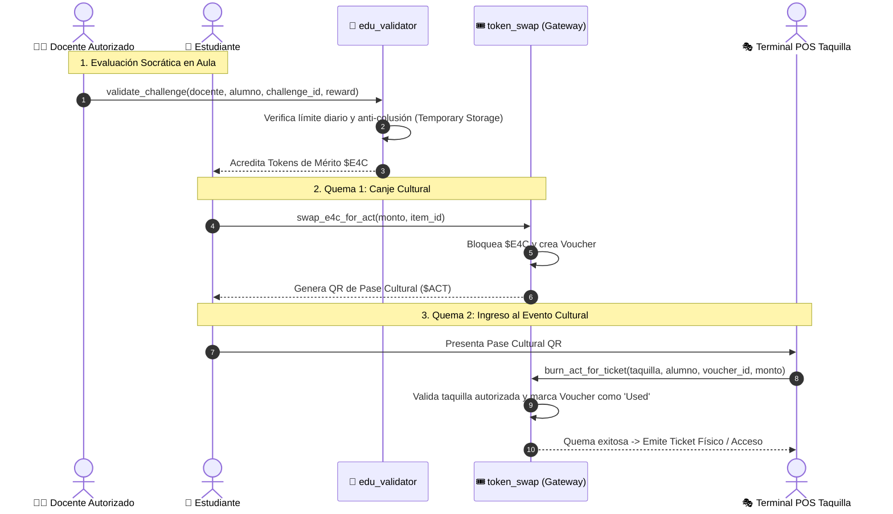
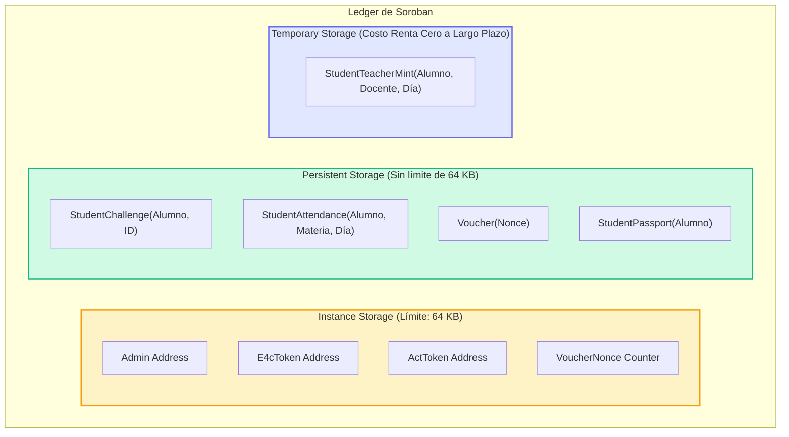

# 🌟 E4C Smart Contracts Architecture (Stellar Soroban Protocol 20+)

[](https://stellar.org/soroban)
[](https://www.rust-lang.org/)
[](https://webassembly.org/)
[](AUDIT_FINDINGS.md)
[](https://buenosaires.gob.ar/educacion)
[](https://opensource.org/licenses/MIT)

> **Repositorio Oficial de Contratos Inteligentes para el Hackathon de Stellar.**  
> Suite modular en **Rust `#![no_std]`** diseñada para incentivos educativos genuinos, registro inmutable de presentismo escolar, reputación académica auditable y una **tokenómica cultural de quema dual ($E4C $\rightarrow$ $ACT $\rightarrow$ Ticket Taquilla)**, 100% libre de especulación financiera.

---

## 📑 Tabla de Contenidos
1. [Visión General y Propósito Pedagógico](#-1-visión-general-y-propósito-pedagógico)
2. [Arquitectura Base de Contratos (Diseño Inicial)](#-2-arquitectura-base-de-contratos-diseño-inicial)
3. [Auditoría de Seguridad y Reingeniería Post-Auditoría](#-3-auditoría-de-seguridad-y-reingeniería-post-auditoría)
4. [Diagramas de Flujo y Almacenamiento](#-4-diagramas-de-flujo-y-almacenamiento)
5. [Estructura del Proyecto](#-5-estructura-del-proyecto)
6. [Guía de Compilación, Testing y Despliegue](#-6-guía-de-compilación-testing-y-despliegue)
7. [Cumplimiento Normativo Escolar y Ética Web3](#-7-cumplimiento-normativo-escolar-y-ética-web3)
8. [Créditos y Firma Institucional](#-8-créditos-y-firma-institucional)

---

## 🎯 1. Visión General y Propósito Pedagógico

El proyecto **E4C (Educación y Cadena)** resuelve tres problemáticas críticas de las escuelas secundarias en la Ciudad Autónoma de Buenos Aires (CABA) y Provincia de Buenos Aires (PBA):
1. **Ausentismo escolar y pérdida de tiempo lectivo:** Registro de presentismo diario directo en ledger con recompensas de mérito.
2. **Pérdida de autoría genuina por copia de IA:** Evaluación formativa mediante diálogo socrático antes de emitir cualquier reconocimiento.
3. **Falta de incentivos de la economía real:** Los tokens acumulados no son criptomonedas especulativas; se canjean por pases culturales de alto valor formativo (libros del FCE, salas del Complejo Teatral de Buenos Aires, Cine Gaumont, Planetario Galileo Galilei, etc.).

### 🏛️ Principios de Diseño
- **Cumplimiento Estricto del Reglamento Escolar de CABA (Art. 32):** Prohibición absoluta de timba, especulación bursátil o pools de liquidez para estudiantes menores de edad.
- **Exclusión de Cooperadoras Escolares:** Toda la gobernanza opera de manera directa y desintermediada entre las Autoridades Escolares/Supervisión, los Docentes, los Alumnos y los Comercios/Taquillas Culturales.
- **Eficiencia en Renta y Almacenamiento:** Arquitectura adaptada al Protocolo 20 de Soroban con gestión proactiva de ciclo de vida (TTL) y separación entre almacenamiento persistente y temporal.

---

## 🏛️ 2. Arquitectura Base de Contratos (Diseño Inicial)

La suite se compone de cuatro contratos inteligentes independientes y desacoplados:

```
                  ┌─────────────────────────────────┐
                  │    Administración Institucional │
                  └────────────────┬────────────────┘
                                   │
         ┌─────────────────────────┼─────────────────────────┐
         ▼                         ▼                         ▼
┌──────────────────┐      ┌──────────────────┐      ┌──────────────────┐
│  edu_validator   │      │    token_swap    │      │  partner_escrow  │
│ (Emisión Mérito) │      │  (Pasarela Dual) │      │ (Custodia/Spon.) │
└────────┬─────────┘      └────────┬─────────┘      └────────┬─────────┘
         │                         │                         │
         │ $E4C                    │ $E4C ➔ $ACT ➔ Ticket    │ Reputación
         └─────────────────────────┼─────────────────────────┘
                                   ▼
                        ┌──────────────────┐
                        │   edu-account    │
                        │ (Smart Account)  │
                        └──────────────────┘
```

### 1. `edu_validator` (Gobernanza Pedagógica y Emisión de Mérito)
- **Objetivo:** Es la única autoridad facultada para emitir y transferir tokens $E4C a los alumnos tras la resolución de desafíos académicos y registro de presentismo.
- **Mecanismos clave:**
  - **Registro de Docentes (`register_teacher`):** El administrador escolar habilita a docentes con su ID de materia (`subject_id`) y cuota diaria (`daily_limit`).
  - **Validación de Desafíos (`validate_challenge`):** Requiere la firma del docente (`teacher.require_auth()`). Asigna entre 1 y 20 E4C base (hasta 40 E4C combinando calificación académica y bono de excelencia).
  - **Mitigación de Colusión Profesor-Alumno:** Límite máximo acumulado de 100 E4C por par (docente, alumno) por día.
  - **Deduplicación de Desafíos:** Impide que un estudiante cobre dos veces el mismo desafío académico.
  - **Presentismo Escolar en Ledger (`validate_daily_attendance`):** Acredita +1 E4C por asistencia diaria, permitiendo una única imputación por materia y día calendario.

### 2. `token_swap` / `E4CCulturalGateway` (Pasarela de Quema Dual Cultural)
- **Objetivo:** Implementar la **Tokenómica Dual** que convierte el mérito académico en experiencias culturales reales, previniendo mercados secundarios y reventas.
- **Mecanismos clave:**
  - **Quema 1 (`swap_e4c_for_act`):** El alumno bloquea y transfiere sus tokens $E4C de mérito al gateway, generando un **Voucher Cultural** numerado y denominado en tokens de acción cultural ($ACT).
  - **Quema 2 (`burn_act_for_ticket`):** La taquilla física o terminal Web POS (`/pos`) escanea el QR del alumno, valida la autorización del comercio (`Validator`) y ejecuta la quema definitiva del voucher, emitiendo el ticket de entrada.
  - **Prevención de Doble Gasto:** El estado del voucher cambia de `Active` a `Used` registrando timestamp y firma de la taquilla interviniente.

### 3. `partner_escrow` (Custodia de Sponsors y Pasaporte de Reputación)
- **Objetivo:** Administrar depósitos de sponsors institucionales (fondos de cultura, ministerios, empresas aliadas) en tokens SAC (USDC / E4C) y gestionar el historial de mérito estudiantil.
- **Mecanismos clave:**
  - **Custodia y Reclamo de Premios (`deposit`, `claim_prize`):** Fondos asignados a premios de olimpiadas escolares y becas de estudio.
  - **Pasaporte Estudiantil (`StudentPassport`):** Registro auditable de reputación acumulada y lista de IDs de desafíos completados por cada alumno.

### 4. `edu-account` (Abstracción de Cuenta - Smart Wallet Escolar)
- **Objetivo:** Proporcionar una experiencia **Web3 Invisible (Low-Friction)** para estudiantes de secundaria, eliminando la fricción de gestionar llaves privadas en papel o pagar comisiones de red.
- **Mecanismos clave:**
  - Implementa la interfaz nativa `CustomAccountInterface` de Soroban.
  - Autenticación mediante verificación criptográfica de firmas (Ed25519 o Passkeys WebAuthn con algoritmo EdDSA COSE -8).
  - Consulta directa de saldos de tokens educativos E4C desde el propio contrato.

---

## 🛡️ 3. Auditoría de Seguridad y Reingeniería Post-Auditoría

Previa a la postulación en el Hackathon, la totalidad del código fue auditado rigurosamente. Se detectaron **7 vulnerabilidades y áreas críticas de mejora**, las cuales fueron remediadas al 100%.

### 📊 Matriz de Hallazgos y Remediaciones

| ID | Vulnerabilidad / Riesgo | Severidad | Estado Previo (Vulnerable) | Estado Post-Auditoría (Remediado) |
|---|---|---|---|---|
| **E4C-SEC-01** | **Agotamiento de Storage de Instancia (64KB DoS)** | 🔴 **CRÍTICA** | Datos dinámicos por alumno se guardaban en `env.storage().instance()`. El contrato colapsaba a los 64 KB. | Migración integral a `persistent()` ledger storage y `temporary()` storage para cuotas diarias. |
| **E4C-SEC-02** | **Control de Acceso Roto en Emisión de Tokens** | 🔴 **CRÍTICA** | `token_swap::mint_e4c` permitía a cualquier usuario firmar como docente y drenar la reserva del contrato. | **Eliminación total de `mint_e4c`** en `token_swap`. Emisión consolidada y protegida en `edu_validator`. |
| **E4C-SEC-03** | **DoS por Archivado de Estado no Renovado (Falta de TTL)** | 🟠 **ALTA** | Sin llamadas a `extend_ttl`. Tras recesos escolares (~120 días), el contrato y datos quedaban archivados. | Incorporación sistemática de `extend_ttl` (`BUMP_THRESHOLD` 30 días, `BUMP_TO` 120 días) en todos los entrypoints. |
| **E4C-SEC-04** | **Errores con Pánico en lugar de Códigos Tipados** | 🟡 **MEDIA** | `partner_escrow` lanzaba `panic!` y `.expect!`, emitiendo `HostError` opaco para la UI frontend. | Creación del enum tipado `#[contracterror] EscrowError` (`#[repr(u32)]`) con retornos `Result<T, EscrowError>`. |
| **E4C-SEC-05** | **Ambigüedad Criptográfica en Smart Account** | 🟡 **MEDIA** | La clave se llamaba `PasskeyId` pero se verificaba con `ed25519_verify`, generando confusión técnica. | Refactorización formal a `SignerKey` con compatibilidad retroactiva transparente para instancias existentes. |
| **E4C-SEC-06** | **Falta de Tests Unitarios en Canje y Cuentas** | 🟡 **MEDIA** | `token_swap` y `edu-account` no tenían tests automatizados en Rust. | Suites completas `#[cfg(test)]` simulando tokens SAC, doble gasto, taquillas no autorizadas y saldos. |
| **E4C-SEC-07** | **Inicialización Expuesta sin Constructor Atómico** | 🔵 **BAJA** | Ventana teórica de front-running entre despliegue e `initialize`. | Guardias estrictas de idempotencia en storage (`AlreadyInitialized`) y compatibilidad para `__constructor`. |

---

### 🔍 Detalle de las Remediaciones Técnicas Principales

#### 1. Prevención del Colapso de 64KB (E4C-SEC-01)
En Soroban, `instance()` comparte **un único ledger entry para todo el contrato limitado a 64 KB**. Almacenar asistencias diarias o vouchers dentro de `instance()` garantizaba el bloqueo total del contrato una vez que la escuela alcanzara unas pocas decenas de alumnos.

```rust
// ❌ ANTES: Vulnerable al límite de 64KB
env.storage().instance().set(&DataKey::Voucher(nonce), &voucher);

// ✅ DESPUÉS: Almacenamiento escalable independiente en Persistent Storage
let voucher_key = DataKey::Voucher(nonce);
env.storage().persistent().set(&voucher_key, &voucher);
env.storage().persistent().extend_ttl(&voucher_key, PERSISTENT_BUMP_THRESHOLD, PERSISTENT_BUMP_TO);
```

Para datos con validez de 24 horas (como la cuota diaria anti-colusión docente-alumno), se implementó **almacenamiento temporal**:
```rust
// ✅ Almacenamiento efímero en temporary() con costo de renta cero tras vencer su ciclo
let teacher_mint_key = DataKey::StudentTeacherMint(student.clone(), teacher.clone(), current_day);
env.storage().temporary().set(&teacher_mint_key, &new_accumulated);
env.storage().temporary().extend_ttl(&teacher_mint_key, TEMPORARY_BUMP_THRESHOLD, TEMPORARY_BUMP_TO);
```

#### 2. Principio de Responsabilidad Única y Fin del Vector de Drenaje (E4C-SEC-02)
Se eliminó la función `mint_e4c` de `token_swap`. Ahora:
- `token_swap` únicamente **recibe, bloquea y quema** tokens en taquilla cultural.
- `edu_validator` es el **único emisor pedagógico**, donde la firma docente es confrontada contra la base de datos de profesores autorizados y sus cuotas diarias.

#### 3. Gestión Preventiva de Renta y TTL (E4C-SEC-03)
Se estandarizó la siguiente regla de renovación en todos los contratos:
```rust
const DAY_IN_LEDGERS: u32 = 17_280;
const INSTANCE_BUMP_THRESHOLD: u32 = 30 * DAY_IN_LEDGERS; // Si restan menos de 30 días
const INSTANCE_BUMP_TO: u32 = 120 * DAY_IN_LEDGERS;       // Renovar hasta 120 días
const PERSISTENT_BUMP_THRESHOLD: u32 = 30 * DAY_IN_LEDGERS;
const PERSISTENT_BUMP_TO: u32 = 120 * DAY_IN_LEDGERS;
```

---

## 🔄 4. Diagramas de Flujo y Almacenamiento

### Flujo 1: Ciclo Pedagógico y Quema Dual Cultural



### Flujo 2: Segregación Óptima de Almacenamiento en Ledger Soroban



---

## 📂 5. Estructura del Proyecto

```
contracts/
├── AUDIT_FINDINGS.md         # Reporte formal de auditoría de seguridad y causas raíz
├── AUDIT_IMPROVEMENTS.md       # Changelog detallado y remediaciones aplicadas
├── README.md                 # Esta documentación técnica integral
├── Cargo.toml                # Workspace o configuración de compilación Rust
│
├── edu_validator/            # Contrato de Validación Pedagógica y Presentismo
│   ├── Cargo.toml            # Dependencias (soroban-sdk = "22.0.0", cdylib, rlib)
│   └── src/
│       └── lib.rs            # Lógica de emisión, anti-colusión, presentismo y tests unitarios
│
├── token_swap/               # Contrato de Pasarela Cultural y Quema Dual
│   ├── Cargo.toml            # Dependencias y configuración de perfiles release
│   └── src/
│       └── lib.rs            # Quema 1 ($E4C->ACT), Quema 2 (POS Ticket) y tests unitarios
│
├── partner_escrow/           # Contrato de Custodia de Sponsors y Pasaporte
│   ├── Cargo.toml            # Dependencias de Soroban SDK
│   └── src/
│       └── lib.rs            # Custodia SAC/USDC, pasaporte de reputación y tests unitarios
│
└── edu-account/              # Smart Account (Abstracción de Cuenta)
    ├── Cargo.toml            # Dependencias y targets de biblioteca
    └── src/
        └── lib.rs            # CustomAccountInterface, verificación Ed25519 y tests unitarios
```

---

## 🛠️ 6. Guía de Compilación, Testing y Despliegue

### 📋 Prerrequisitos
- **Rust:** Versión estable 1.80+ con target `wasm32v1-none`:
  ```bash
  rustup target add wasm32v1-none
  ```
- **Stellar CLI (anteriormente Soroban CLI):**
  ```bash
  cargo install --locked stellar-cli --features opt
  ```

---

### 🧪 Ejecución de Pruebas Unitarias
Todas las pruebas unitarias simulan el entorno completo de Soroban en memoria con tokens SAC administrados:

```bash
# Ejecutar tests de un contrato específico (ej: token_swap)
cargo test --manifest-path contracts/token_swap/Cargo.toml

# Ejecutar tests de validación docente y límites anti-colusión
cargo test --manifest-path contracts/edu_validator/Cargo.toml

# Ejecutar tests de custodia institucional y pasaporte
cargo test --manifest-path contracts/partner_escrow/Cargo.toml

# Ejecutar tests de Smart Account y lectura de saldos
cargo test --manifest-path contracts/edu-account/Cargo.toml
```

> **Cobertura de Tests:**
> - ✅ Verificación de doble gasto de vouchers en taquilla.
> - ✅ Rechazo de comercios y taquillas no autorizadas.
> - ✅ Control de montos inválidos (negativos o cero).
> - ✅ Control de límites de colusión profesor-alumno (tope diario 100 E4C).
> - ✅ Presentismo único diario por materia.
> - ✅ Rango calibrado de recompensas socráticas (1 a 40 E4C).
> - ✅ Prevención de doble inicialización de contratos.

---

### 🔨 Compilación a WebAssembly (`.wasm`)

Para compilar los contratos optimizados para la red Stellar:

```bash
# Opción 1: Mediante Stellar CLI (Recomendado)
stellar contract build

# Opción 2: Mediante Cargo nativo
cargo build --target wasm32v1-none --release
```

Los artefactos resultantes se generan en `target/wasm32v1-none/release/*.wasm`.

#### Optimización de Binarios (Bajar tamaño y consumo de gas)
```bash
stellar contract optimize --wasm target/wasm32v1-none/release/edu_validator.wasm
stellar contract optimize --wasm target/wasm32v1-none/release/token_swap.wasm
stellar contract optimize --wasm target/wasm32v1-none/release/partner_escrow.wasm
stellar contract optimize --wasm target/wasm32v1-none/release/edu_account.wasm
```

---

### 🚀 Despliegue en Stellar Testnet

#### 1. Configurar Identidad y Red
```bash
stellar keys generate --global admin --network testnet
stellar network add --global testnet \
  --rpc-url https://soroban-testnet.stellar.org:443 \
  --network-passphrase "Test SDF Network ; September 2015"
```

#### 2. Desplegar Bytecode
```bash
# Desplegar edu_validator
VALIDATOR_ID=$(stellar contract deploy \
  --wasm target/wasm32v1-none/release/edu_validator.optimized.wasm \
  --source admin \
  --network testnet)

# Desplegar token_swap
SWAP_ID=$(stellar contract deploy \
  --wasm target/wasm32v1-none/release/token_swap.optimized.wasm \
  --source admin \
  --network testnet)

echo "Validator Contract ID: $VALIDATOR_ID"
echo "Swap Gateway Contract ID: $SWAP_ID"
```

#### 3. Inicializar Contratos
```bash
# Inicializar Gateway de Token Swap
stellar contract invoke \
  --id $SWAP_ID \
  --source admin \
  --network testnet \
  -- \
  initialize \
  --admin $(stellar keys address admin) \
  --e4c_token <E4C_SAC_ADDRESS> \
  --act_token <ACT_SAC_ADDRESS>
```

---

## ⚖️ 7. Cumplimiento Normativo Escolar y Ética Web3

Los contratos de E4C fueron diseñados respetando rigurosamente el marco regulatorio del sistema educativo formal argentino:

1. **Prevención Activa de Ludopatía y Especulación (Reglamento Escolar CABA Art. 32):**
   - Los tokens $E4C y $ACT carecen de pares de liquidez en AMMs descentralizados y no pueden comercializarse por dinero fiduciario.
   - El único destino de los tokens es el canje directo por experiencias formativas aprobadas por el catálogo institucional.
2. **Exclusión de Cooperadoras Escolares:**
   - Para evitar conflictos de recaudación y fricción administrativa, las cooperadoras no forman parte del flujo de tokens ni de la tesorería de los contratos.
3. **Privacidad de Menores (COPPA y Ley N° 25.326):**
   - Los contratos registran únicamente direcciones públicas (`Address`), IDs de desafíos y marcas temporales. 
   - **Ningún dato personal identificable (nombres, DNI, cursos o fotos) se escribe en el ledger público de Stellar.**
4. **Resiliencia ante Recesos Escolares:**
   - La extensión sistemática de TTL asegura que durante los meses de vacaciones escolares (diciembre a marzo) el estado del contrato no sea archivado por la red.

---

## ✍️ 8. Créditos y Firma Institucional

- **Autor y Desarrollador:** Equipo E4C (EduAndChain)
- **Contacto y Correo de Git Oficial:** `eduandchain@gmail.com`
- **Hackathon:** Stellar Community Hackathon / Soroban Waves
- **Documentos Complementarios:**
  - 📖 [Hallazgos Detallados de Auditoría (`AUDIT_FINDINGS.md`)](AUDIT_FINDINGS.md)
  - 🚀 [Registro Técnico de Remediaciones (`AUDIT_IMPROVEMENTS.md`)](AUDIT_IMPROVEMENTS.md)
